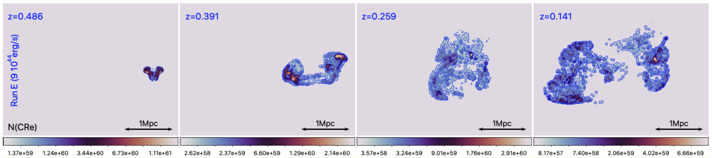

Welcome!

This is the public parallel version of the cosmic ray solver (e.g. Fokker Planck without diffusion terms) we developed and used in Vazza, Wittor, di Federico et al. 2022 A\&A), to study the advection, aging and re-acceleration of cosmic ray electrons injected by radiogalaxies in the intracluster medium simulated with the ENZO code (but it can work with any tracer-like datasets). 

It is written in 1.4.0 Julia. 

The code requires as input a sequence of tracers data, written in HDF5 format (see /tracers folder for an example dataset for 99 tracers evolved for 100 timestpes), and it computes particle spectra under radiative and coulomb losses, adiabatic compression/rarefaction, and injection+re-acceleration by shock waves and Fermi II. 

- The input tracer files contain particle ID information and gas physical quantities, like gas density [g/cm3], gas temperature[K], magnetic fields strength [microGauss],  3D vorticity and divergence [1/s] and redshift of each snapshot. The physical size/mass to be associated to each tracer particle must instead be set within the code. 
A file sample of 99 tracers and 100 timesteps, derived from our simulation, is given in the /tracers subfolder

* The main code is FP_new.jl

     - The code generates the simultaneous evolution of the same set of electron spectra, for three different scenarios of cosmic ray acceleration and losses (only cooling - cooling & shock reacceleration or - cooling, shock re-acceleration and turbulent re-acceleration. 
     - The code is already instrumented to run with 4 parallel Julia threads  (it requires the Distributed and SharedArrays packages).
      

* Additional necessary functions are: 

     - param_spectra_par_log.jl  > containing  parameters of input spectra and momentum binning, which can be changed here (pmin, pmax, dlogp).

     -  loss_gain_par_log.jl   > containing all acceleration and loss terms, necessary for the Fokker-Planck evolution (Chang & Cooper 1970 - like). 

* The animated gif gives an example of the evolving particle spectra that our method produces for the three implemented ageing/re-acceleration models.

* Details on the method and on its application to cosmological simulations are described in the main paper. 

