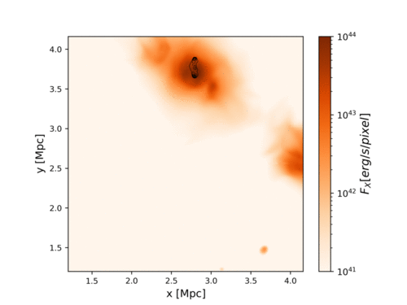

Welcome!

This is the public serial version of the cosmic ray solver (e.g. Fokker Planck without diffusion terms) we developed and used in Vazza, Wittor, Brunetti & Bruggen 2021, to study the advection, aging and re-acceleration of cosmic ray electrons injected by radiogalaxies in the realistic intracluster medium. 

The code requires as input a sequence of tracers data, written in HDF5 format (see /tracers folder for an example dataset), and it computes particle spectra under radiative and coulomb losses, adiabatic compression/rarefaction, and injection+re-acceleration by shock waves. 

- The input tracer files contain particle ID information and gas physical quantities like gas density [g/cm3], gas temeperature[K], magnetic fields strength [microGauss],  3D vorticity and divergence [1/s] and redshift). 
A file sample of 25 tracers and 50 timesteps, derived from our simulation, is given in the /tracers subfolder

* The main code is FP_public.jl

     - The code generates the simultaneous evolution of the same set of electron spectra, over 50 time snapshots, for three different scenarios of cosmic ray acceleration and losses (only cooling - cooling & shock reacceleration or - cooling & shock re-acceleration (according to diffuse shock acceleration). 
      

* Additional necessary functions are: 

     - param_spectra.jl  > containing  parameters of input spectra and momentum binning, which can be changed here (pmin, pmax, dp).

     -  loss_gain1.jl   > containing all acceleration and loss terms, necessary for the Fokker-Planck evolution (Chang & Cooper 1970 - like). 

* This is an example of the particle spectra that the above code should produce

* Details on the method and on its application to cosmological simulations are described in Vazza, Wittor, Brunetti & Bruggen, 2021 A&A (submitted, as of this writing). 

