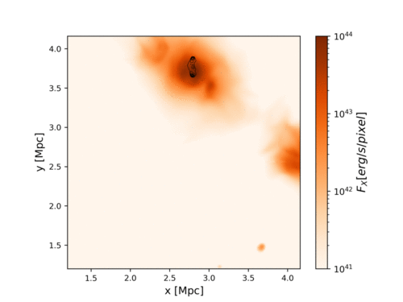

# JULIA
(Growing) collection of programs coded in Julia, for postprocessing of grid (mostly Enzo) data

See also https://github.com/MatteoAngelinelli repository for Julia routines to analyse our Enzo simulations. 

Updated list

1.  [scaling_plot.jl](https://github.com/FrancoVazza/JULIA/blob/master/scaling_plot.jl) = plotting of a few different sequence of data for comparison

2. [LOS.jl](https://github.com/FrancoVazza/JULIA/blob/master/LOS.jl) = reading in a N x M tabulated matrix from a file and overplotting different columns

3. [map_serial.jl](https://github.com/FrancoVazza/JULIA/blob/master/map_serial.jl) = simple map making tool for ENZO simulations (using hdf5 datasets) and producing maps with Winston. 

4. [map_par.jl](https://github.com/FrancoVazza/JULIA/blob/master/map_par.jl)   =  map making of cubic grid data with uniform resolution, written in hdf5. Works in parallel using Distributed Arrays. Tested up to 64 cores on Piz Daint, and with grids up to 1024^3. Necessary packages: Distributed Arrays, HDF5, FITSIO 
 
5. [miro_par4.jl](https://github.com/FrancoVazza/JULIA/blob/master/miro_par4.jl)   = parallel version of the MIRO code (here the IDL version https://github.com/FrancoVazza/MIRO). It feature the generation of random 3D magnetic field with components obeying an input power-law spectrum and keeping div(B)=0 through the use of vector potential. Can work in parallel using DistributedArrays. Necessary packages: FFTViews and DistributedArrays

6. [map_simple.jl](https://github.com/FrancoVazza/JULIA/blob/master/map_simple.jl) = map  of cubic grid data with uniform resolution, written in hdf5. Works in serial, Necessary packages:  HDF5, FITSIO, PyPlot

7. [rotate.jl](https://github.com/FrancoVazza/JULIA/blob/master/rotate.jl) = routine to rotate 3D vector arrays (using Rotations,  CoordinateTransformations and StaticArrays)

8. [tracers_spectra_work.jl](https://github.com/FrancoVazza/JULIA/blob/master/tracers_spectra_work.jl) = injection & advection of tracer particles in Enzo dataset + Fokker-Planck routines to evolve spectra of relativistic particles

9. [shocks_test.jl](https://github.com/FrancoVazza/JULIA/blob/master/shocks_test.jl) = shock finder for Enzo simulations

10. [map_sequence.jl](https://github.com/FrancoVazza/JULIA/blob/master/map_sequence.jl) =  program to produce overlays of contours and colors from a sequence of fits files, to produce something like: 

LARGER PROJECTS (all work in progress! ):

- MAPS_ALL : map making for ENZO unigrid simulation, using DistributedArrays(requires Julia v0.6), including shock-finding and computing X-ray emission, Sunyaev Zeldovich, HI, synchrotron and Faraday Rotation).
- TRECS : production of galaxy catalog from large simulation, in order to cope with the TRECS algorithm to produce SKA-like surveys (Bonaldi et al. 2017).
- FP_Julia : Fokker Planck evolution of relativistic particle spectra in Julia, for passive tracer particles.
- Tristan : analysis routines for Tristan-MP simulations
- INFORMATION : routines to compute statistical complexity in ENZO simulations. 
