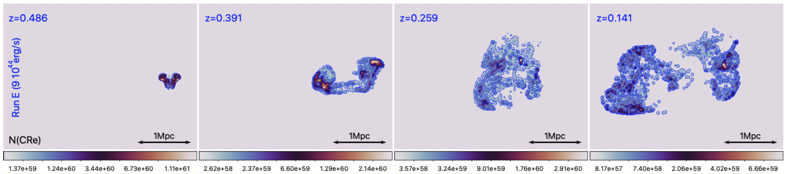

Welcome!

This is the public parallel version of the ROGER* code (i.e. "Relativistic sOlver for GeV Electrons and for their Radio emission) to study the advection, aging and re-acceleration of cosmic ray electrons injected by radiogalaxies in the intracluster medium simulated with the ENZO code (but it can work with any tracer-like datasets). 

It is written in 1.4.0 [Julia](https://julialang.org/). 

The code requires as input a sequence of tracers data, written in HDF5 format (see /tracers folder for an example dataset for 99 tracers evolved for 100 timestpes), and it computes particle spectra under radiative and coulomb losses, adiabatic compression/rarefaction, and injection+re-acceleration by shock waves and Fermi II. 

The sample input tracer files contain particle ID information and gas physical quantities, like gas density [g/cm3], gas temperature[K], magnetic fields strength [microGauss],  3D vorticity and divergence [1/s] and redshift of each snapshot. The physical size/mass to be associated to each tracer particle must instead be set within the code. 
A file sample of 99 tracers and 100 timesteps, derived from our simulation, is given in the /tracers subfolder

* The main code is ROGER.jl It generates the simultaneous evolution of the same set of electron spectra, for three different scenarios of cosmic ray acceleration and losses (only cooling - cooling & shock reacceleration or - cooling, shock re-acceleration and turbulent re-acceleration. ROGER is already instrumented to run with 4 parallel Julia threads  (it requires Julia's Distributed and SharedArrays packages). 
      

* Additional necessary functions are: 

     - param_spectra_par_log.jl  > containing  parameters of input spectra and momentum binning, which can be changed here (pmin, pmax, dlogp).

     -  loss_gain_par_log.jl   > containing all acceleration and loss terms, necessary for the Fokker-Planck evolution (Chang & Cooper 1970 - like). 

* The animated gif gives an example of the evolving particle spectra that our method produces for the three implemented ageing/re-acceleration models.

* Details on the method and on its application to cosmological simulations are described in the [main paper](https://ui.adsabs.harvard.edu/abs/2023A%26A...669A..50V/abstract). 

* ROGER (also in its preliminary versions) has been used to produce the following publications:

  - Vazza, Wittor, Brunetti & Bruggen 2021, A&A, https://ui.adsabs.harvard.edu/abs/2021A%26A...653A..23V/abstract
  - Hodgson, Bartalucci et al. 2021, ApJ, https://ui.adsabs.harvard.edu/abs/2021ApJ...909..198H/abstract
  -  Vardoulaki, Vazza et al. 2021, Galaxies, https://ui.adsabs.harvard.edu/abs/2021Galax...9...93V/abstract
  -  Brienza et al. 2022, A&A, https://ui.adsabs.harvard.edu/abs/2022A%26A...661A..92B/abstract
  -  Vazza, Wittor, Di Federico, Bruggen, Brienza et al. 2023 A&A, https://ui.adsabs.harvard.edu/abs/2023A%26A...669A..50V/abstract
  -  Vazza, Wittor, Bruggen, Brunetti 2023, Galaxies, https://ui.adsabs.harvard.edu/abs/2023Galax..11...45V/abstract
  -  Smolinski, Wittor, Bruggen & Vazza 2023, MNRAS, https://ui.adsabs.harvard.edu/abs/2023MNRAS.tmp.2902S/abstract
    
* A big thank to D. Smolinski, D. Wittor, M. Brueggen and L. Beduzzi for having tested ROGER and having reported to me bugs and mistakes! 
  
* ROGER obvioulsy is an homage to the greatest of all times in tennis, who retired in the same month in which this paper was published: https://www.youtube.com/watch?v=cQCJ_r_szIc

